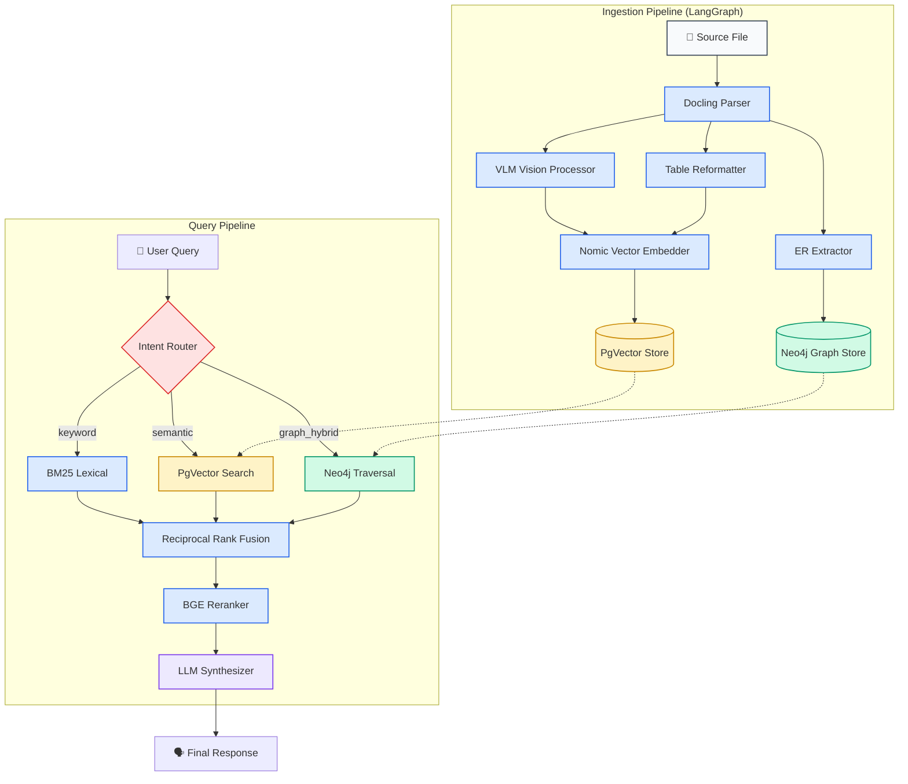

# 🧠 Agentic-RAG: Local-First Advanced Retrieval-Augmented Generation

[](https://www.python.org/downloads/)
[](https://ollama.ai/)
[](https://neo4j.com/)
[](https://github.com/pgvector/pgvector)
[](https://opensource.org/licenses/MIT)

An industry-grade, local-first **Agentic RAG** system that combines the semantic depth of Vector Search (PgVector) with the structured entity-relationships of Graph Databases (Neo4j). Designed to be a fully plug-and-play solution for offline, confidential, and highly-accurate document Q&A.

---

## 🌟 Key Features

* **Local-First & Offline Ready:** Defaults to running entirely on your local hardware using **Ollama** (Embeddings, Reranking, ER Extraction, and Generation). No data leaves your machine.
* **True Hybrid Retrieval:** Combines BM25 (Lexical), Vector Search (Semantic), and Neo4j Graph traversals. Results are unified using **Reciprocal Rank Fusion (RRF)**.
* **Agentic Intent Routing:** Automatically detects if a query needs simple keyword search, deep semantic retrieval, or complex "deep explanation" synthesis, and routes the workflow accordingly.
* **Multi-modal Ingestion (Docling):** Seamlessly parses PDFs, extracts tabular data (with rule-based and LLM-based reformatting), and processes images using local Vision models (Llama 3.2 Vision).
* **Graph Knowledge Base:** Extracts `(subject, relation, object)` triples during ingestion to build a highly structured episodic memory and semantic graph in Neo4j.

---

## 🏗️ Architecture

The pipeline consists of a LangGraph-orchestrated ingestion flow and an intelligent query-routing retrieval flow.



---

## 🚀 Quickstart

### 1. Prerequisites

You will need the following installed:
* **Docker & Docker Compose** (for PostgreSQL and Neo4j)
* **Python 3.10+**
* **Ollama** (Running locally on `http://localhost:11434`)

### 2. Pull Required Local Models

Make sure you have pulled the required models via Ollama. By default, the application is configured to use:

```bash
# Chat / Generation Model (used for Synthesis & Intent Routing)
ollama pull gpt-oss:latest

# Embeddings Model
ollama pull nomic-embed-text-v2-moe:latest

# Vision Model (for parsing images in PDFs)
ollama pull llama3.2-vision:latest

# Reranker Model
ollama pull bge-reranker-v2-m3
```

*(Note: You can override these defaults in your `.env` file to use `llama3.1`, `gemma`, or any other model of your choice).*

### 3. Environment Setup

Clone the repository and set up a virtual environment:

```bash
git clone https://github.com/yourusername/Agentic-RAG.git
cd Agentic-RAG

python -m venv .venv
source .venv/bin/activate  # On Windows: .venv\Scripts\activate

pip install -r requirements.txt
```

Create a `.env` file in the root directory (you can copy from `.env.example`). No API keys are required if you are using the local Ollama stack!

### 4. Start Infrastructure (Databases)

Launch PostgreSQL (PgVector) and Neo4j using the provided Docker Compose file:

```bash
docker-compose up -d
```

### 5. Ingest Documents

Place your PDFs, Markdown, or text files into a directory (e.g., `data/`) and run the ingestion pipeline:

```bash
python -m src.main ingest data/
```
The ingestion process will:
1. Parse text, tables, and images.
2. Generate semantic chunks.
3. Extract Graph Triples (Entities and Relations).
4. Persist to PgVector and Neo4j.

### 6. Run the Application

Start the FastAPI backend and Chat interface:

```bash
# Start the Backend API (runs on port 8000)
python -m src.main serve

# Start the Streamlit Frontend (runs on port 8501)
streamlit run src/frontend/app.py
```
Open `http://localhost:8501` in your browser to start chatting with your knowledge base!

---

## 🔍 Semantic vs. Keyword Search

Agentic-RAG employs a **Hybrid Strategy** to provide the best of both worlds:
1. **Keyword (BM25):** Excellent for exact part numbers, specific names, or acronyms.
2. **Semantic (Vector):** Excellent for conceptual matching and understanding intent, even if the exact words aren't used.
3. **Graph Search:** Traverses relationships between entities that might not be textually close in the original document but are logically connected.

The results from all three strategies are scored and merged using **Reciprocal Rank Fusion (RRF)**, ensuring the most relevant chunks rise to the top. Finally, a Cross-Encoder Reranker provides a final relevance pass before generation.

## 📄 License

This project is licensed under the MIT License. See the [LICENSE](LICENSE) file for details.
