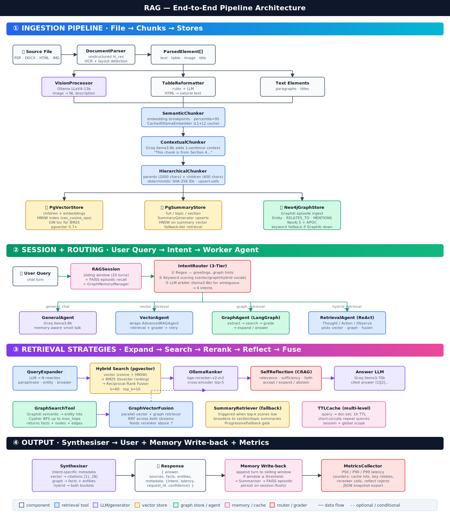

# RAG3 — Robust Local-First RAG: Setup & Command Reference

> **Version:** 1.1.0 &nbsp;|&nbsp; **Python:** 3.11+ &nbsp;|&nbsp; **Orchestration:** LangGraph + Haystack

A confidential, local-first agentic RAG pipeline.

**Key ideas (from `docs/idea.txt`):**

- **Docling** parses PDFs into Markdown *and* crops images/charts with bounding boxes.
- A local **VLM (llama3.2-vision:11b via Ollama)** describes every cropped image/chart.
- Raw image bytes → **MinIO**; their VLM summaries → **pgvector** with the MinIO URL stored in metadata, so retrieval can surface the original image alongside the answer.
- Ingestion is orchestrated by a **LangGraph state machine** (parse → VLM → MinIO → structure → embed → store → graph).
- **Pluggable graph backends:** Neo4j / FalkorDB / Postgres-based PG-Graph / `none`, selectable per run.
- **Pluggable vector backend:** pgvector primary + in-memory Numpy fallback on failure.
- **LLM fallback chain:** Groq (primary) → OpenRouter → Ollama.
- **Entity-Relation extraction for the graph DB** uses **`gpt-oss:20b`** — Ollama local → Groq `openai/gpt-oss-20b` → OpenRouter `openai/gpt-oss-20b`.
- **Multi-key rotation** for both Groq *and* OpenRouter (429 on one key → automatic switch to the next).
- **Local HuggingFace reranker** — `bge-reranker-v2-m3` from `D:\MODELS\bge-reranker-v2-m3`.

---

## Table of Contents

1. [Architecture & Pipeline Flow](#1-architecture--pipeline-flow)
2. [Component Matrix](#2-component-matrix)
3. [Install](#3-install)
4. [External Services](#4-external-services)
5. [Environment Configuration (.env)](#5-environment-configuration-env)
6. [Command Reference](#6-command-reference)
7. [Ingestion Pipeline — Step by Step](#7-ingestion-pipeline--step-by-step)
8. [Retrieval Pipeline — Step by Step](#8-retrieval-pipeline--step-by-step)
9. [Fallback Semantics](#9-fallback-semantics)
10. [Troubleshooting](#10-troubleshooting)

---

## 1. Architecture & Pipeline Flow



```
┌──────────────────────── INGESTION (LangGraph) ────────────────────────┐
│                                                                       │
│  PDF / DOCX / HTML                                                    │
│      │                                                                │
│      ▼                                                                │
│  DoclingParser ──► Markdown + cropped image PNGs + tables             │
│      │                                                                │
│      ▼                                                                │
│  VisionProcessor (Ollama llama3.2-vision:11b) ──► image summaries     │
│      │                                                                │
│      ▼                                                                │
│  MinIO (raw images) ──► returns URL                                   │
│      │                                                                │
│      ▼                                                                │
│  LLM structure cleanup (Groq → OpenRouter → Ollama fallback)          │
│      │                                                                │
│      ▼                                                                │
│  Chunks  (text + table + image_summary{image_url})                    │
│      │                                                                │
│      ├──► nomic-embed (Ollama) ──► pgvector / in-memory store         │
│      └──► graph_store.add_episode (Neo4j / Falkor / PG-Graph / none)  │
└───────────────────────────────────────────────────────────────────────┘

┌─────────────────────────── RETRIEVAL ─────────────────────────────────┐
│  Query                                                                │
│    │                                                                  │
│    ▼                                                                  │
│  RAGSession (window + FAISS memory)                                   │
│    │                                                                  │
│    ▼                                                                  │
│  IntentRouter (regex → keyword → LLM arbiter)                         │
│    │                                                                  │
│    ├─► GeneralAgent   (chit-chat)                                     │
│    ├─► VectorAgent    (hybrid pgvector + BM25 → rerank → reflect)     │
│    ├─► GraphAgent     (LangGraph state machine; backend pluggable)    │
│    └─► RetrievalAgent (ReAct planner for mixed queries)               │
│    │                                                                  │
│    ▼                                                                  │
│  Synthesiser ──► answer + sources (with image URLs for image hits)    │
└───────────────────────────────────────────────────────────────────────┘
```

---

## 2. Component Matrix

| Concern | Default | Alternates | Fallback |
|---------|---------|-----------|----------|
| Parser | Docling | — | `unstructured` (if docling missing) |
| Vision | Ollama `llama3.2-vision:11b` | any Ollama multimodal tag | static caption |
| Text LLM | Groq (Llama 3.x 70B/8B) | OpenRouter, Ollama | empty-string (fail-safe) |
| ER Extraction (graph) | Ollama `gpt-oss:20b` | Groq `openai/gpt-oss-20b`, OpenRouter `openai/gpt-oss-20b` | keyword-only episodes |
| Reranker | **Local HF** `D:\MODELS\bge-reranker-v2-m3` | Ollama HTTP | lexical overlap |
| Embedding | Ollama `nomic-embed-text` | — | — |
| Vector DB | pgvector | in-memory Numpy | auto fallback |
| Graph DB | Neo4j + Graphiti | FalkorDB, PG-Graph | `none` (NullGraphStore) |
| Object Store | MinIO | — | local filesystem |
| Memory | FAISS episodic | — | Numpy brute-force |
| Orchestration | LangGraph | — | sequential Python |

---

## 3. Install

```bash
cd D:/Vaibhav/RAG
python -m venv .venv
.venv\Scripts\activate

pip install -e .

# Core optional extras (install what you need)
pip install docling                    # PDF → Markdown + image crops
pip install langgraph>=0.2.0           # ingestion + graph-agent state machines
pip install minio                      # object store
pip install transformers torch         # local HF bge-reranker
pip install falkordb                   # FalkorDB graph backend (optional)
pip install graphiti-core              # entity/relation extraction for Neo4j
pip install faiss-cpu                  # episodic memory
pip install ragas                      # evaluation
```

Every optional dep is wrapped in a try/except — missing packages degrade gracefully.

---

## 4. External Services

### 4.1 Ollama

```bash
ollama pull nomic-embed-text
ollama pull llama3.2-vision:11b
ollama pull gpt-oss:20b                 # ER extraction primary
ollama serve                            # http://localhost:11434
```

### 4.2 MinIO (Docker)

```bash
docker run -d --name minio \
  -p 9000:9000 -p 9001:9001 \
  -e MINIO_ROOT_USER=minioadmin \
  -e MINIO_ROOT_PASSWORD=minioadmin \
  minio/minio server /data --console-address ":9001"
# Console: http://localhost:9001
```

### 4.3 PostgreSQL + pgvector

```sql
CREATE DATABASE rag3;
\c rag3
CREATE EXTENSION IF NOT EXISTS vector;
-- tables are auto-created by PgVectorStore.initialise() and PgGraphStore.initialise()
```

### 4.4 Neo4j (default graph backend)

```bash
docker run -d --name neo4j \
  -p 7474:7474 -p 7687:7687 \
  -e NEO4J_AUTH=neo4j/neo4j \
  -e NEO4J_PLUGINS='["apoc"]' \
  neo4j:5
```

### 4.5 FalkorDB (optional graph backend)

```bash
docker run -d --name falkor -p 6379:6379 falkordb/falkordb:latest
```

### 4.6 Local reranker model

Make sure `D:\MODELS\bge-reranker-v2-m3` contains a valid HuggingFace checkpoint
(`config.json`, `pytorch_model.bin` or `model.safetensors`, tokenizer files).

---

## 5. Environment Configuration (.env)

```ini
# -------- Groq (primary LLM) — multi-key rotation --------
GROQ_API_KEYS=gsk_key1,gsk_key2          # 2+ keys; auto-rotates on 429
LLM__PRIMARY_MODEL=llama-3.3-70b-versatile
LLM__FAST_MODEL=llama-3.1-8b-instant

# -------- OpenRouter (LLM fallback) — multi-key rotation --------
OPENROUTER_API_KEYS=or-k1,or-k2          # 2+ keys; auto-rotates on 429/402
OPENROUTER__PRIMARY_MODEL=meta-llama/llama-3.3-70b-instruct
OPENROUTER__FAST_MODEL=meta-llama/llama-3.1-8b-instruct

# -------- Entity-Relation extraction (graph ingestion) --------
# Ollama local (primary) → Groq (fallback, rotates keys) → OpenRouter (secondary fallback)
ER__OLLAMA_MODEL=gpt-oss:20b
ER__GROQ_MODEL=openai/gpt-oss-20b
ER__OPENROUTER_MODEL=openai/gpt-oss-20b
ER__MAX_TRIPLES_PER_EPISODE=20
ER__FALLBACK_CHAIN=["ollama","groq","openrouter"]

# -------- Ollama --------
OLLAMA__BASE_URL=http://localhost:11434
OLLAMA__EMBEDDING_MODEL=nomic-embed-text
OLLAMA__VISION_MODEL=llama3.2-vision:11b
OLLAMA__CHAT_MODEL=llama3:8b

# -------- Postgres --------
POSTGRES__HOST=localhost
POSTGRES__PORT=5432
POSTGRES__DB=rag3
POSTGRES__USER=postgres
POSTGRES__PASSWORD=postgres

# -------- Neo4j --------
NEO4J__URI=bolt://localhost:7687
NEO4J__USER=neo4j
NEO4J__PASSWORD=neo4j

# -------- FalkorDB --------
FALKOR__HOST=localhost
FALKOR__PORT=6379
FALKOR__GRAPH_NAME=rag3

# -------- MinIO --------
MINIO__ENDPOINT=localhost:9000
MINIO__ACCESS_KEY=minioadmin
MINIO__SECRET_KEY=minioadmin
MINIO__SECURE=false
MINIO__BUCKET=rag3-assets

# -------- Local reranker --------
RERANKER__BACKEND=local_hf
RERANKER__MODEL_PATH=D:\MODELS\bge-reranker-v2-m3
RERANKER__DEVICE=auto       # cpu | cuda | auto

# -------- Backend selection (defaults; CLI flags override) --------
GRAPH_BACKEND=neo4j         # neo4j | falkor | pggraph | none
VECTOR_BACKEND=auto         # pgvector | memory | auto
LLM_FALLBACK_CHAIN=["groq","openrouter","ollama"]
```

Nested keys use the `__` delimiter (Pydantic v2 `BaseSettings`).

---

## 6. Command Reference

Every command accepts `--graph-backend / -g` and `--vector-backend / -v` to override the config for that run.

### 6.1 Health check

```bash
python -m src.main healthcheck
python -m src.main healthcheck -g falkor -v memory
```

Reports: Groq/OpenRouter config, Postgres / Neo4j / FalkorDB / MinIO reachability, reranker path, which backends actually came up.

### 6.2 Ingest a file

```bash
python -m src.main ingest "docs/paper.pdf"
```

Runs the **LangGraph ingestion pipeline**:

1. Docling parse (Markdown + cropped PNGs + tables)
2. Ollama `llama3.2-vision:11b` describes each image
3. Upload PNGs to MinIO, get URLs
4. Groq (→ OpenRouter → Ollama) cleans the Markdown
5. Build `text` / `table` / `image_summary` chunks (image summaries carry `image_url`)
6. Embed with `nomic-embed-text` → write to pgvector (or in-memory)
7. Push text chunks as episodes to the selected graph backend

### 6.3 Ingest a directory

```bash
python -m src.main ingest "D:/Data/pdfs" --recursive
```

### 6.4 Use FalkorDB instead of Neo4j

```bash
python -m src.main ingest "docs/paper.pdf" -g falkor
python -m src.main chat -g falkor
```

### 6.5 Use Postgres as graph backend (no Neo4j, no Falkor)

```bash
python -m src.main chat -g pggraph
```

### 6.6 Disable graph entirely (vector-only RAG)

```bash
python -m src.main chat -g none
```

### 6.7 Force in-memory vector store (pgvector down)

```bash
python -m src.main chat -v memory
```

### 6.8 Interactive chat

```bash
python -m src.main chat
python -m src.main chat --session-id my-session
```

When the retrieved answer cites an `image_summary` chunk, the source list shows its MinIO `image_url` so the UI can fetch and render it.

### 6.9 Evaluate

```bash
python -m src.main evaluate eval/questions.jsonl --output reports/run1.json
```

---

## 7. Ingestion Pipeline — Step by Step

File: `src/ingestion/langgraph_pipeline.py` (class `LangGraphIngestionPipeline`).

| Node | Function | What it does |
|------|----------|--------------|
| `parse` | `DoclingParser.run` | Markdown + cropped image PNGs + tables |
| `vlm_describe` | `VisionProcessor.describe_bytes` | llama3.2-vision:11b describes every crop |
| `push_images` | `MinioObjectStore.put_bytes` | Upload PNGs, collect URLs |
| `structure` | `chat_sync(...)` | Cleanup Markdown (Groq→OpenRouter→Ollama) |
| `prepare_docs` | — | Build `text` / `table` / `image_summary` Documents; image summaries carry `image_url` in meta |
| `embed_and_store` | `CachedOllamaEmbedder.run` + `vector_store.upsert_documents` | Embed + persist |
| `push_to_graph` | `graph_store.add_episode` + `extract_triples` + `add_triples` | Push text chunks as graph episodes *and* write ER-extracted triples via `gpt-oss:20b` chain |

Tail sequence runs either via LangGraph's `StateGraph` or a sequential Python fallback — same semantics either way.

---

## 8. Retrieval Pipeline — Step by Step

File: `src/agents/orchestrator.py` + `src/agents/router.py` + workers.

1. **Session bootstrap** — `RAGSession.build_context()` pulls the sliding window + FAISS episodic memory.
2. **Intent router** (`src/agents/router.py`):
   - Tier 1 regex — greetings / clear graph phrasing (“relationship between…”).
   - Tier 2 keyword scoring — `_VECTOR / _GRAPH / _HYBRID_KEYWORDS`.
   - Tier 3 LLM arbiter — Groq fast model if still uncertain.
3. **Worker dispatch:**
   - `general_chat` → `GeneralAgent`.
   - `vector_retrieval` → `VectorAgent` (expansion → hybrid search → **local HF bge-reranker** → CRAG self-reflect).
   - `graph_retrieval` → `GraphAgent` (LangGraph: entity_extract → graph_search → grade → expand/answer).
   - `hybrid_retrieval` → `RetrievalAgent` (ReAct over vector + graph + fusion tools).
4. **Synthesiser** — intent-specific payload. For vector/hybrid results, each source carries its `image_url` when the hit was an image summary.

---

## 9. Fallback Semantics

**Graph backend (`-g` / `GRAPH_BACKEND`)** — factory at `src/storage/graph/factory.py`:

| Preferred | Fallback chain |
|-----------|----------------|
| `neo4j`   | neo4j → falkor → pggraph → NullGraphStore |
| `falkor`  | falkor → neo4j → pggraph → NullGraphStore |
| `pggraph` | pggraph → neo4j → falkor → NullGraphStore |
| `none`    | NullGraphStore (graph features disabled) |

**Vector backend (`-v` / `VECTOR_BACKEND`)** — factory at `src/storage/vector/factory.py`:

| Preferred | Behaviour |
|-----------|-----------|
| `pgvector` | strict; raises if unreachable |
| `memory`   | in-memory Numpy store only |
| `auto`     | try pgvector, fall back to in-memory |

**LLM provider chain** (`LLM_FALLBACK_CHAIN`) — `src/utils/llm.py`:

```
groq  ─failure/empty─►  openrouter  ─failure/empty─►  ollama
```

Each provider is tried once per call; the first non-empty reply wins.

**Multi-key rotation inside Groq & OpenRouter** — when a provider is selected, its client rotates through its own key pool on each 429 / 402 / 401:

```
Groq       (RotatableGroqGenerator)   : GROQ_API_KEYS=k1,k2,...
OpenRouter (OpenRouterClient)         : OPENROUTER_API_KEYS=k1,k2,...
```

Only after every key in a provider's pool fails does the outer chain move on.

**ER extraction chain** (`ER__FALLBACK_CHAIN`) — `src/utils/er_extractor.py`:

```
Ollama  gpt-oss:20b            (primary — local, confidential)
   └─ failure/empty ─►
Groq    openai/gpt-oss-20b     (multi-key rotation)
   └─ failure/empty ─►
OpenRouter  openai/gpt-oss-20b (multi-key rotation)
```

Extracted `(subject, relation, object)` triples are written to the active
graph backend via `BaseGraphStore.add_triples()` — implemented natively
in Neo4j, FalkorDB, and PG-Graph. The `add_episode()` call still runs in
parallel, so graph search works even if ER extraction returns empty.

**Reranker backend** (`RERANKER__BACKEND`) — `src/retrieval/strategies/reranking.py`:

```
local_hf  (primary, D:\MODELS\bge-reranker-v2-m3)
   └─ on load failure →  lexical overlap fallback
ollama    (HTTP path; legacy, optional)
```

---

## 10. Troubleshooting

| Symptom | Likely cause | Fix |
|---------|-------------|-----|
| `docling not installed — will fall back to unstructured` | `pip install docling` missing | install or accept degraded mode |
| `minio package not installed — using local filesystem fallback` | `pip install minio` missing | install or accept local-only mode |
| `langgraph not installed — ingestion uses sequential fallback` | `pip install langgraph>=0.2.0` | install or accept sequential fallback |
| `failed to load local HF reranker` | wrong `RERANKER__MODEL_PATH` or missing `transformers`/`torch` | fix path or `pip install transformers torch` |
| Reranker slow on CPU | no GPU | set `RERANKER__DEVICE=cuda` or lower `RERANKER__BATCH_SIZE` |
| `All LLM providers failed` | Groq key invalid + no OpenRouter key + Ollama down | set one valid provider |
| Vector search returns 0 docs after ingest | embedder model tag mismatch between ingest + query | verify `OLLAMA__EMBEDDING_MODEL` consistent |
| Graph queries empty | running with `-g none` or Graphiti not installed (Neo4j) | switch backend (`-g falkor` or `-g pggraph`) or install `graphiti-core` |

---

**See also:**
- `docs/SETUP.md` — base setup + pipeline flow narrative
- `docs/RAG3_SETUP_AND_IMPLEMENTATION.md` — deep-dive reference (Phases 1–2 internals)
- `docs/pipeline_flow.svg` — visual pipeline diagram
- `docs/idea.txt` — source spec for this robust variant
